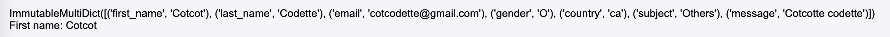
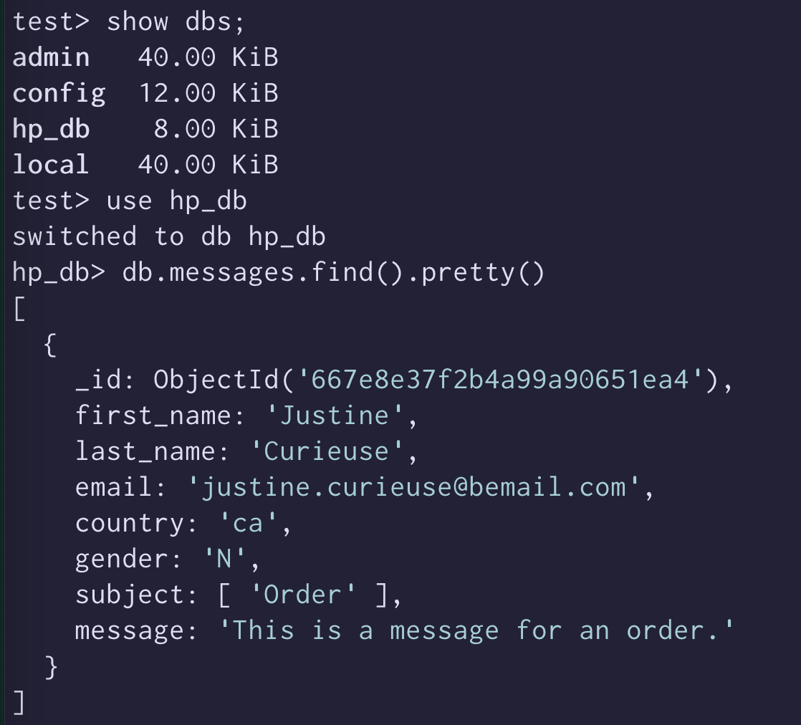

# Secure form with Python & Flask

[See the instructions for this project](./project_instructions.md)

## Todo / Writeup

+ [x] Create an app.py
+ [x] Create index.html page
+ [x] Create contact.html page and add contact route to app.py
+ [x] Create a common layout for both pages
+ [x] In the contact page, create a HTML form
    + [x] Add some styles so my eyes don't bleed
    + [ ] Better way to add countries
+ [x] Retrieve data 
+ [x] Display error messages in the form
+ [ ] Validate form inputs
+ [ ] Sanitize form inputs
+ [x] Add thank you page with summary
+ [ ] Add DB    
    + [ ] SQL
    + [x] MongoDB
+ [ ] Implement honeypot anti-spam technique


## Basic structure

We need `app.py`, `requirements.txt` and a `templates/index.html` page.

### `app.py`
This is our server-side code.  

```python
from flask import Flask, render_template, request

app = Flask(__name__)

@app.route("/")
def index():
    return render_template("index.html")
```

Refs: [Flask docs for 2.2.5](https://flask.palletsprojects.com/en/2.2.x/)  
Concepts: python import fom libraries, class instanciation, decorators...

### Run local server 

```
flask run --debug 
```

We use `--debug` in order to not have to reload server everytime we make a change in the code.

We don't need to precise `--app app.py` if the name of our main file is `app.py`

We're telling the browser that when the url is the homepage (`/`), we display the content of `index.html`.

So let's create an index page.

## Create an index page

```html
<!DOCTYPE html>
<html lang="en">
    <head>
        <meta charset="UTF-8">
        <meta name="viewport" content="width=device-width, initial-scale=1.0">
        <title>🐔 Hackers Poulette 🐔</title>
    </head>
    <body>
        <h1>We are 🐔 Hackers Poulette 🐔 !</h1>
        <p>Welcome to Hackers Poulette shop</p>
    </body>
</html>
```

## Create a contact page with a form

```html
<form action="/submit-form" method="post">
    <div>
        <label for="first_name">First Name</label>         
        <input name="first_name" type="text" id="first_name" placeholder="First Name" required>

        <label for="last_name">Last Name</label>
        <input type="text" id="last_name" name="last_name" placeholder="Last Name" required>
    </div>
    <div>
        <label for="email">Email</label>
        <input type="email" id="email" name="email" required>
    </div>
    <div>
        <label>Gender</label>
        <label for="male"><input type="radio" id="male" name="gender" value="M" required> Male</label>
        <label for="female">
            <input type="radio" id="female" name="gender" value="F" required> Female
        </label>
        <label for="other">
            <input type="radio" id="other" name="gender" value="O" required> Other
        </label>
        <label for="prefer-not">
            <input type="radio" id="prefer-not" name="gender" value="N" required> Prefer not to say
        </label>
    </div>
    <div>
        <label for="country">Country</label>
        <select id="country" name="country" required>
            <option value="">Select your country</option>
            <option value="us">France</option>
            <option value="ca">Belgique</option>
            <option value="uk">Suisse</option>
            <option value="au">Pays-Bas</option>
            <!-- Add better way to add countries later -->
        </select>
    </div>
    <div>
        <label>Subject</label>
        <label for="repair">
            <input type="checkbox" id="repair" name="subject" value="Repair">
            Repair
        </label>
        <label for="order"><input type="checkbox" id="order" name="subject" value="Order"> Order</label>
        <label for="others"><input type="checkbox" id="others" name="subject" value="Others" checked> Others</label>
    </div>
    <div>
        <label for="message">Message</label>
        <textarea id="message" name="message" required></textarea>
    </div>
    <button type="submit">Submit</button>
</form>
```


## Add route to app.py
```python
@app.route("/contact")
def contact():
    return render_template("contact.html")
```

## Create a common layout 
There is a lot of common code between the index page and the contact page.
Creating a common layout that you then extends depending what you need makes changing things easier, as you don't have to go to multiple places to change it.
This reduces the amount of work you have to do and the possibility of forgetting a file.  (DRY: Don't Repeat Yourself)

This is called [template inheritance](https://jinja.palletsprojects.com/en/3.1.x/templates/#template-inheritance)

The templating engine used by Flask is Jinja.  
Docs: https://jinja.palletsprojects.com/en/3.1.x/

Some other templating engines: [Twig](https://twig.symfony.com/) for the PHP framework symfony, Blade for Laravel...

In layout.html we'll have
```html
<!DOCTYPE html>
<html lang="en">
    <head>
        <meta charset="UTF-8">
        <meta name="viewport" content="width=device-width, initial-scale=1.0">
        <title>🐔 Hackers Poulette 🐔</title>
    </head>
    <body>
        
    </body>
</html>
```

And index.html will look like this  
```html



    <h1>We are 🐔 Hackers Poulette 🐔 !</h1>
    <p>Welcome to Hackers Poulette</p>

```
  
While contact.html will look like 
```html



    <h1>Contact us 🐔</h1>
    <form><!-- ... --></form>

```

## Adding some styles 
Flask expects your styles to be in the folder `static/`.
Then in the layout.html file, we can create a dynamic URL with the special flask method `url_for()`.

```html
<link rel="stylesheet" href="{{ url_for('static', filename='styles.css') }}">
```

## Retrieve the data

Now that we have a form, we need to retrieve the data that a user would input.
The form action attribute is `/submit-form`
We add a route that accepts POST requests that will return to the template `message_sent.html`.

```python
@app.route("/submit-form", methods=["POST"])
def submit_form():
    return render_template("message_sent.html")
```

https://flask.palletsprojects.com/en/3.0.x/quickstart/#accessing-request-data

In Flask, we use the [request object](https://flask.palletsprojects.com/en/3.0.x/quickstart/#the-request-object) to access request data.

This is one of the library we import on the first line of app.py.
`from flask import Flask, render_template, request`

With the variable `request.form`, we can access data send in a POST request, so we add it as a second argument after the route to the  `render_template()` function, in order to have access to it in the template.
```python
return render_template("message_sent.html", form=request.form)
```

If we just display the form with `{{ form }}`, we get:


We see its type is `ImmutableMultDict`, which is a type of dictionnary specific to Flask.

We can display the fields with `{{ form['first_name'] }}`, `{{ form['email'] }} `...

## Display error messages for empty fields

We now need to prevent the form to be submitted if all the mandatory fields are not present. 
In the `submit_form()` function, we'll create an `errors` dictionnary that will contains the errors for the missing fields.

```python
@app.route("/submit-form", methods=["POST"])
def submit_form():
    errors = {}
    first_name = request.form['first_name']
    last_name = request.form['last_name']
    email = request.form['email']

    # <...>

   if not first_name:
        errors['first_name'] = 'First name is required.'
    if not last_name:
        errors['last_name'] = 'Last name is required.'
    if not email:
        errors['email'] = 'Email is required.'
```

If a field is missing, we store a message in the errors dictionnary that we'll then display back on the contact form under the field.

```html
    <div>
        <label for="first_name">First Name</label>         
        <input name="first_name" type="text" id="first_name" placeholder="First Name">
        
            <span class="error">{{ errors.first_name }}</span>
        
    </div>
    <div>
        <label for="last_name">Last Name</label>
        <input type="text" id="last_name" name="last_name" placeholder="Last Name">
        
            <span class="error">{{ errors.last_name }}</span>
        
    </div>
    <...>
```

We modify the `contact()` method to pass an empty `errors` dictionnary to the template:
Otherwise, we'll have an error message, when trying to display the template because if it's the first time displaying the contact form, then the errors variable doesn't exist yet.  

```python
@app.route("/contact")
def contact():
    return render_template("contact.html", errors={})
```

To test that it works, we'll also need to remove the required attributes from the form fields, which provides client-side validation but is enough by itself.

## Preventing XSS

[OWASP](https://owasp.org/www-community/attacks/xss/)

In Flask, using the method `render_template()` already provides protection against XSS.

> Flask configures Jinja2 to automatically escape all values unless explicitly told otherwise. This should rule out all XSS problems caused in templates

[Flask docs - Cross-Site Scripting (XSS)](https://flask.palletsprojects.com/en/1.1.x/security/#cross-site-scripting-xss)


## Connecting to databases

### MongoDB

We'll use mongodb via **docker**.

To pull a mongodb image, create and run a mongodb container:
`docker pull mongo`
`docker run -d -p 27017:27017 --name mongodb mongo`

We will install the package [pymongo](https://www.mongodb.com/docs/drivers/pymongo/) in order to interact with MongoDB. 
The package pymongo provides a way to connect to MongoDB, perform CRUD (Create, Read, Update, Delete) operations, and execute other database commands from within a Python application. 

`pip install pymongo`

Then we import it in `app.py`

```python
from pymongo import MongoClient

# ...

# Connect to MongoDB
client = MongoClient('localhost', 27017)  # Connect to the Docker container
db = client['hp_db']
collection = db['messages']

# ...

# We insert data into MongoDB
# In method submit_form

if errors:
    return render_template('contact.html', errors=errors, form=request.form)
else:
    collection.insert_one({
        'first_name': first_name,
        'last_name': last_name,
        'email': email,
        'country': country,
        'gender': gender, 
        'subject': subject, 
        'message': message
    })
    return render_template("message_sent.html", form=request.form)
```

#### Verify that data has been inserted in the db

```bash
# Run container
docker exec -it mongodb mongosh

# Show databases
show dbs

# We can see that the database hp_db has been created 

use hp_db

# Display messages collection
db.messages.find().pretty()
```



It works ! :) 